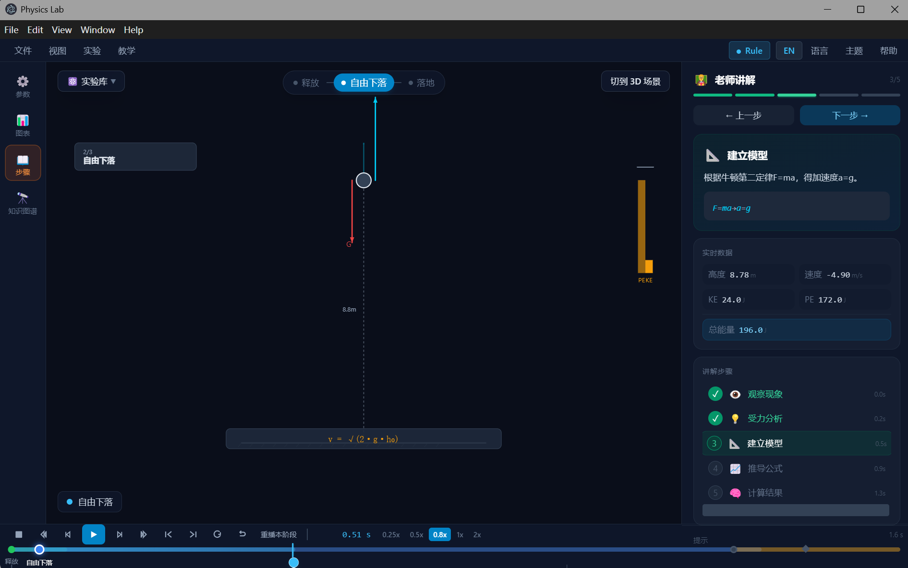

# Physics Lab — AI 物理教学动画引擎

> 把任意物理题变成一堂"看得见为什么"的动画课：题目输入 → AI 解析 → 可交互教学动画。



一个面向初学者的物理学习工具。学生输入一道物理题（自由落体、平抛、斜面、电路……），系统自动解析物理实体与参数，生成**带有教学节奏的交互式动画**——不是演示动画，而是"会运动的物理示意图"。

## 核心特性

- **任意题目输入**：文本/拍照/PDF 三种输入方式，云端 AI（OpenAI 兼容接口）+ 本地规则解析器双链路，诚实降级
- **Hybrid 2D+3D 渲染**：平面问题默认 2D 矢量图解（极简扁平科学可视化），空间问题 3D 场景建立直觉——2D/3D 同一数据源、五色语义统一
- **教学节奏引擎**：首播自动讲解节奏（阶段减速 + 关键事件停顿）、0.8x 默认初学者速度、分阶段重播
- **教学红线**：宁可诚实失败，不可错误动画——解析器对不支持/非物理/缺参数输入明确拒绝，绝不硬凑
- **教学图层**：PhaseCard / FormulaStrip / ForceCallout / EventPulse 四模板，随动画阶段演进
- **确定性回放**：`state = f(t)` 纯函数渲染，Timeline 任意拖动逐元素一致

## 快速开始

```bash
# 安装依赖
npm install

# 开发模式（Electron + Vite）
npm run dev

# 生产构建
npm run build

# 测试门禁（185 用例）
npx vitest run
```

> 云端 AI 为可选配置：应用内 帮助 → 设置 → 云 AI 填入任意 OpenAI 兼容接口（如 DeepSeek）。不配置时自动使用本地规则解析器。

## 架构

```
physics-lab/
├── apps/desktop/          # Electron + React + R3F 渲染层
│   └── src/renderer/      # 2D SVG 渲染器 / 3D 场景 / 教学图层 / 面板体系
├── packages/shared/       # PhysicsScene 场景 Schema（唯一数据源）
├── packages/ai-parser/    # 规则解析器 + 云端 Provider + 教学脚本生成器
└── docs/                  # 产品/引擎/状态/历史文档（00-05 分层）
```

**核心数据流**：`题目文本 → AI/规则解析 → PhysicsScene（唯一 Schema）→ 2D/3D 渲染器 + 教学图层 → 教学节奏回放`

## 文档

| 目录 | 内容 |
|------|------|
| `docs/01_FOUNDATION` | 产品愿景 / 架构红线 / 开发规则（只读基座） |
| `docs/02_PRODUCT` | PRD、Hybrid 2D+3D 动画规格、2D 矢量渲染规格、教学图层规格 |
| `docs/03_ENGINE` | PhysicsScene Schema、API 规格、数据库设计 |
| `docs/04_PROJECT` | 当前状态、Sprint 计划、云 AI 测试报告 |
| `docs/05_HISTORY` | 设计决策记录（DD-001~003）、变更日志 |
| `CASE_STUDY.md` | 项目复盘：从需求到交付的完整决策链 |

## 质量门禁

- TypeScript 严格模式 0 错误（shared / desktop 双包）
- Vitest 185 用例全绿
- 生产构建通过
- 端到端实测：13 题真实题目矩阵（含边界题），教学红线 0 违背

## License

MIT
